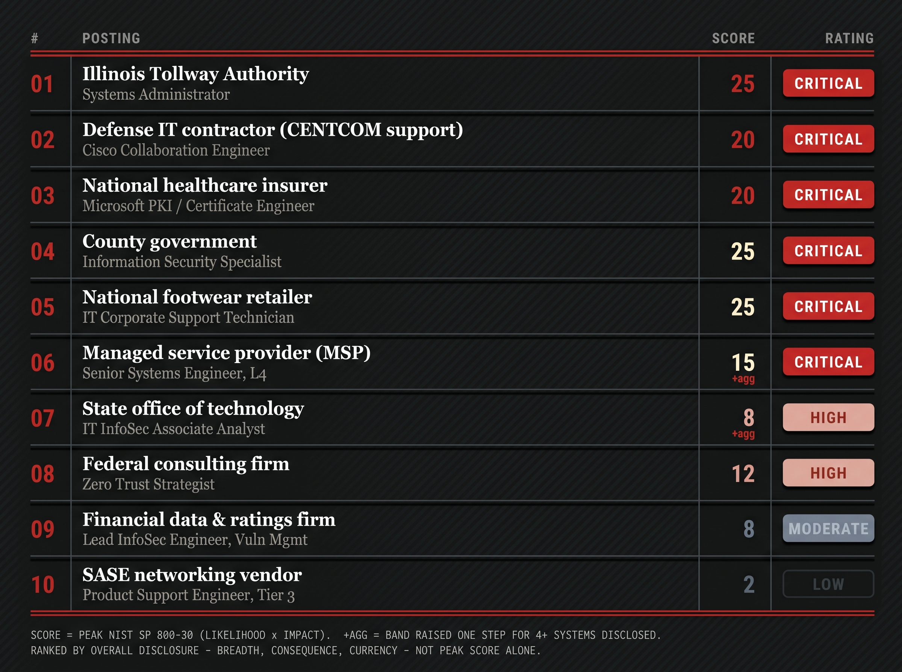

<!--
  Properties above:
  - dek: one-sentence hook shown under the title and on cards.
  - tags: first tag is the red category pill. No spaces: threat-research, data-breaches.
  - cover: drag the lead image into this folder and name it "cover", or type its file name here.
  - draft: untick (false) when it's ready, then Commit-and-sync to publish.
  Comments like this one never appear on the site.
-->

I spent an evening this week just scrolling through job postings. Not to find a job! But to see what free reconnaissance companies willingly give out. With a few specially geared Google searches, I found some genuinely surprising results. Attackers don't need to break in when they can just read how your network is laid out.

No single line looks reckless but add a few together and you've got a kill chain. "Experience with Palo Alto firewalls" or "Administer Veeam Backup & Replication" seems reasonable enough but this helps attackers map your network just by stopping and reading.

As we've seen the IT job market surge for qualified candidates, companies don't realize they're exposing intimate details of their network. Attackers can gain valuable intel. Is the network on-prem or off-prem? An Azure or AWS tenant? Quickly, this increases the attack surface and opens the door for all sorts of exploits. 

For example, an Illinois job posting practically lays out an entire kill chain. From the internet-facing Citrix NetScaler to their on-prem Exchange, this gives clear attack vectors. Known exploits like Citrix Bleed (CVE-2023-4966) or ProxyShell (CVE-2021-34473) can be tested against the environment with relative ease. Citrix Bleed is a bug that allows attackers to send malformed web requests to the company's NetScaler which then returns a raw dump of the NetScaler's memory. This memory includes session data which then allows them to log straight into your Cloud Provider's portal. 

Remember this is all just from a few Google searches, we wonder why phishing emails have gotten so good? It's because attackers now have the capability to scrub your company's online presence such as job postings and see exactly who your vendors are. They don't even have to break in. Pretending to be your own vendor and sending a malicious link then BOOM, You're in.

Using a simple search such as a "Google Dork", you narrow down your target even more. Google dorks are an advanced way to query the web with specialized operators. "filetype:" or "inurl:" are examples of this. The dork below limits my search to the website Lever which is a popular applicant tracking software. The keywords in quotes then forces Google to only return pages containing my phrases. I can aim these queries to find companies that overshare their own tech stack.

````markdown
site:jobs.lever.co "Entra ID" "Intune" "Defender for Endpoint" "Sentinel"
````

To wrap up this discussion, the fix costs nothing to the company. Companies should reanalyze their online presence from social media to their internal resources. Instead of "Splunk Enterprise Security" say "Centralized SIEM and log aggregation platforms", this gives enough details for your candidates. There is a tradeoff to for being more vague but would you rather advertise for the role and not advertising a target?

For this article, I ranked ten public IT job postings by how much free reconnaissance each one hands an attacker. I scored them with the NIST SP 800-30 method, where the score is Likelihood times Impact, on a scale of 1 to 25. Each score then lands in a category: Low, Moderate, High, or Critical.

I flagged a posting "+agg" when it gave away four or more systems at once, enough to map most of a network. Since the score only counts a posting's single worst item, those "+agg" flags are what let a wider leak outrank a higher-scoring but narrower one. Ironically, it may be that the most honest map of your network might be the one sitting on your public job board.



> [!disclosure]
> All findings and analysis are my own. The above job postings were also anonymized.


